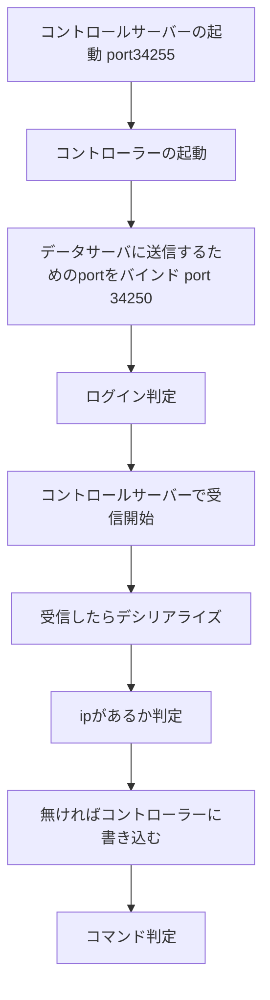

## flow
> powered by [mermaid](https://mermaidjs.github.io/#/)

図にしたものは[こちら](https://tinyurl.com/tktx6hh)

```mermaid
graph TD
A[コントロールサーバーの起動 port34255]
B[コントローラーの起動]
C[データサーバに送信するためのportをバインド port 34250]
D[ログイン判定]
E[コントロールサーバーで受信開始]
F[受信したらデシリアライズ]
G[ipがあるか判定]
H[無ければコントローラーに書き込む]
I[コマンド判定]


A -->B
B --> C
C --> D
D --> E
E --> F
F --> G
G --> H
H --> I
```
